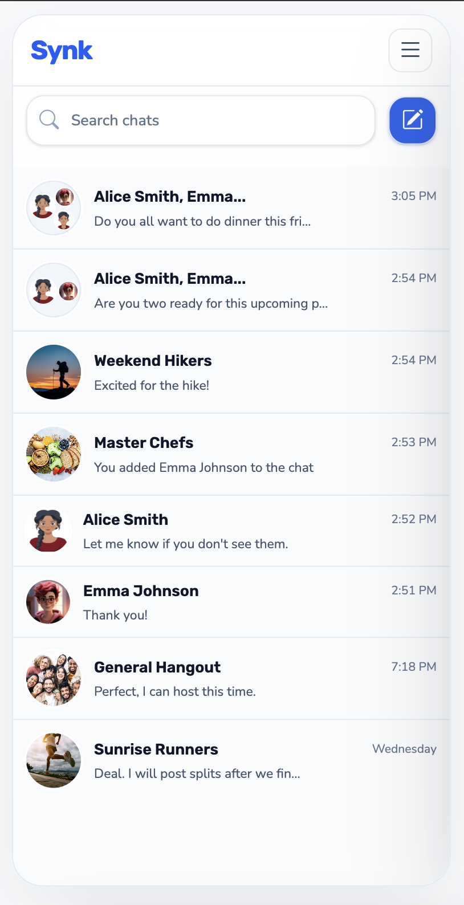
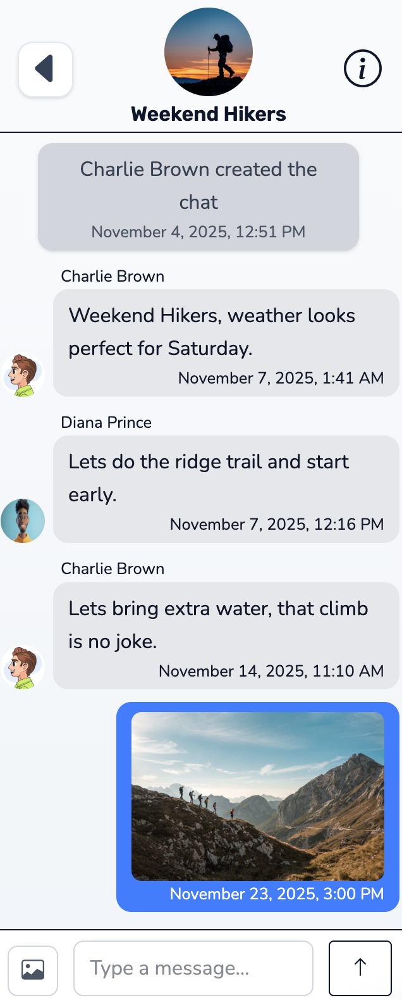
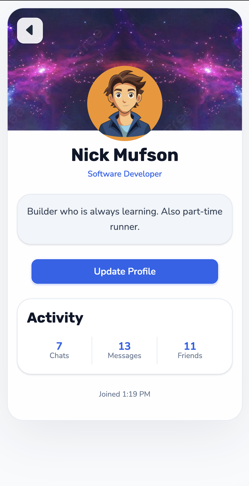
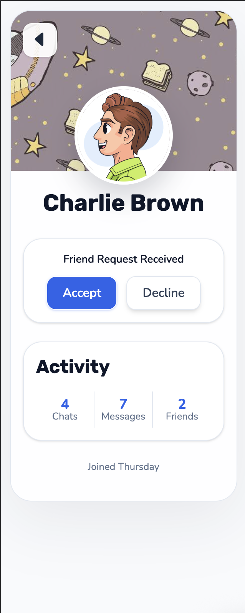
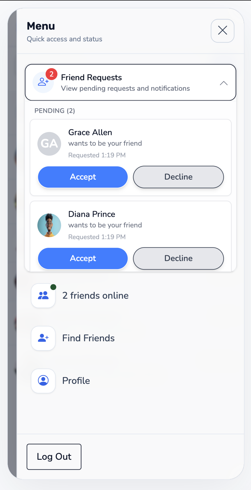
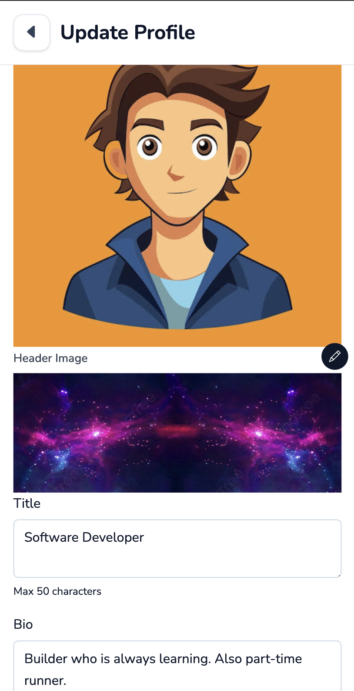
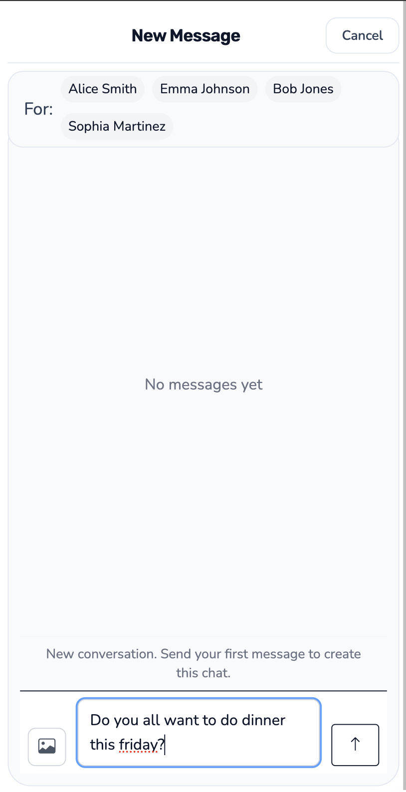
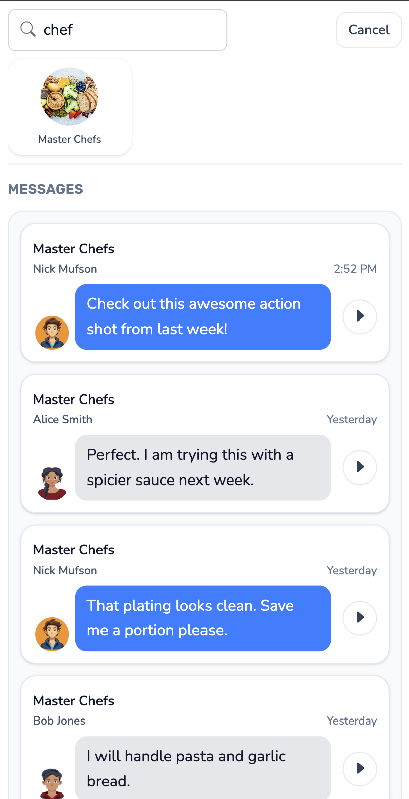
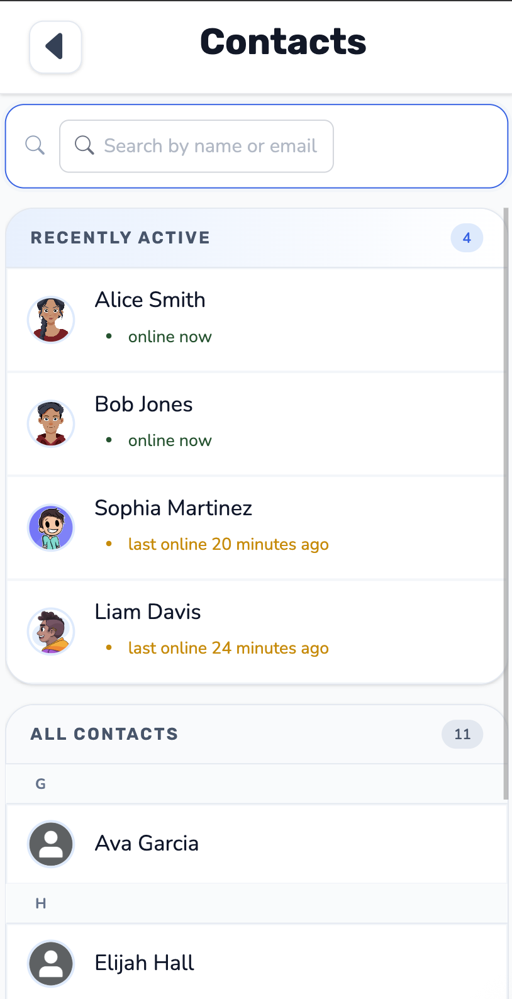
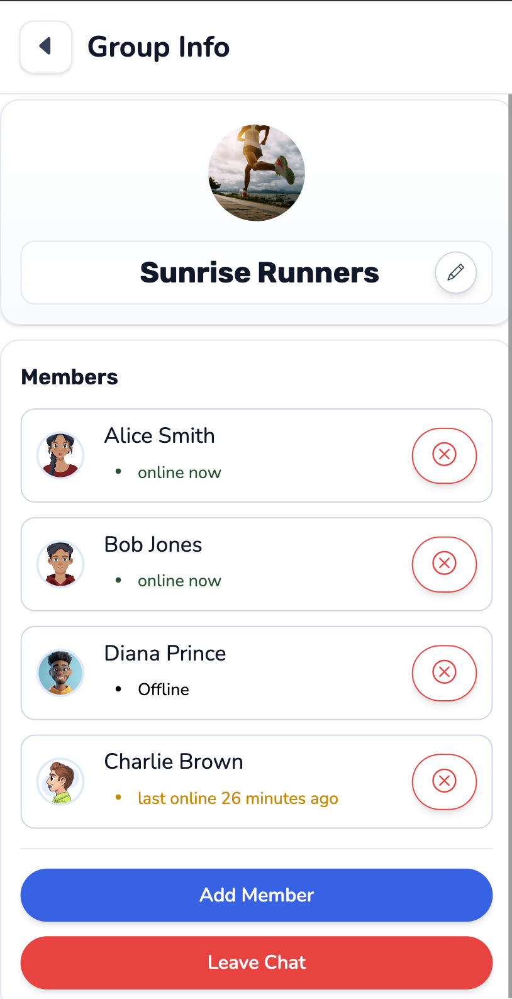

# Messaging App (Portfolio Project)

Full-stack messaging platform built with Next.js, Express, tRPC, Prisma, and PostgreSQL.

This repository is currently in progress.

## Demo

[Watch the screen recording](./docs/readme-assets/demo-recording.mov)

| Chats                                              | Active conversation                              |
| -------------------------------------------------- | ------------------------------------------------ |
|  |  |

| My profile                                         | Other user profile                                       |
| -------------------------------------------------- | -------------------------------------------------------- |
|  |  |

| Friend requests                                              | Profile editing                                            |
| ------------------------------------------------------------ | ---------------------------------------------------------- |
|  |  |

| Start a conversation                                        | Search within chats                                  |
| ----------------------------------------------------------- | ---------------------------------------------------- |
|  |  |

| Contacts                                       | Chat details                                     |
| ---------------------------------------------- | ------------------------------------------------ |
|  |  |

### Implemented

- User authentication with session-based login/logout and profile-aware user context
- Profile creation and editing
- Direct and group conversations
- Real-time activity updates via WebSocket subscriptions
- Friend request flow (send, accept, decline, cancel)
- Online presence and recent presence tracking
- Conversation and message search flows
- Image upload signature flow for Cloudinary

## Technology Stack

### Frontend

- Next.js 15
- React 19
- TanStack Query
- Tailwind CSS and React Bootstrap

### Backend

- Node.js
- Express 5
- tRPC 11
- WebSocket server using ws

### Database and Data Modeling

- PostgreSQL
- Prisma ORM
- Zod schemas for API input and DTO validation

## Feature Highlights

1. Real-time Messaging and Activity Feed

- Live updates for new messages and chat actions through tRPC subscriptions over WebSockets
- UI cache synchronization using subscription events and query cache updates

2. Conversation System

- Supports both direct and group chats
- Automatic chat creation when messaging a new set of participants
- Chat list previews and unread activity tracking

3. Profile Friendships

- Friend request lifecycle: pending, accepted, declined, cancelled
- Profile relationship states surfaced in the UI
- Friend connect/disconnect updates persisted in relational data

4. Presence and Engagement

- Online status and last seen tracking
- Presence updates available globally and within chat scopes

5. Profile and Media Workflows

- Editable profiles with avatar/header support
- Image upload signature endpoint integrated with Cloudinary

6. Search and Discoverability

- Conversation targeting and profile search for potential chats
- Text and photo message search queries
